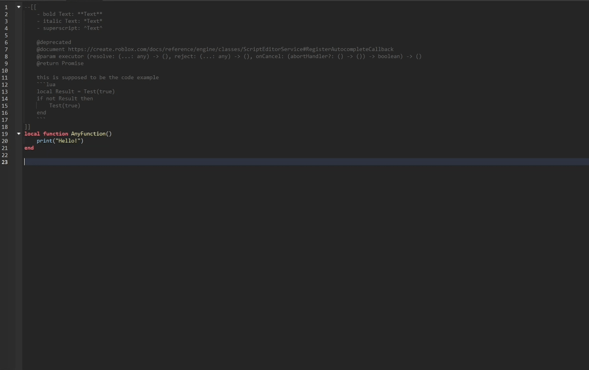

<div align="center">
<h1 align="center">Roana</h1>
  <p align="center">
	a Roblox Studio plugin that enhances user-defined function documentation with Tags and Limited Markdown
  </p>
  <p align="center">
	Designed to work with Moonwave styled documentation
  </p>
    <a href="https://github.com/OssieNomae/Roana">Github</a>
    ·
    <a href="https://create.roblox.com/store/asset/133335131052891/Roana">Creator Marketplace</a>
  </p>
</div>

## Installation
### [Creator Marketplace 🖱️](https://create.roblox.com/store/asset/133335131052891/Roana)
_The Creator Marketplace is the easiest way to install Roana. You'll get access to automatic updates and be able to use the plugin anywhere you have Roblox Studio installed._

### Manual Installation
1. Download the plugin (.rbxmx) file from [Releases](https://github.com/OssieNomae/Roana/releases)
2. Drag and Drop the plugin file into the Roblox Studio "Plugins Folder" _(TopBar -> Plugins -> Plugins Folder)_

## Example
````luau
--[[
	- bold Text: **Text**
	- italic Text: *Text*
	- superscript: ^Text^
	
	@deprecated
	@document https://create.roblox.com/docs/reference/engine/classes/ScriptEditorService#RegisterAutocompleteCallback
	@param executor (resolve: (...: any) -> (), reject: (...: any) -> (), onCancel: (abortHandler?: () -> ()) -> boolean) -> ()
	@return Promise 
	
	this is supposed to be the code example
	```lua
	local Result = Test(true)
	if not Result then
		Test(true)
	end
	```
]]
local function AnyFunction()
	print("Hello!")
end
````

<br />
<p>
  <a href=""></a>
</p>
